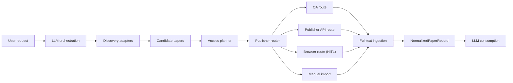

# paper-search-agent Architecture

A local-first scholarly paper discovery, access planning, and full-text retrieval system.

## Core Principle

**Discovery ≠ Full-text access.** Finding a paper does not mean you can retrieve its full text. The system is explicitly split into discovery and entitlement-aware retrieval, and this separation is the primary architectural rule.

## System Layers



### 1. Discovery Layer

Discovers papers via multi-source search. Does not assume every discovered paper is retrievable.

**Implemented adapters:** OpenAlex, Crossref, Scopus, Springer Meta, arXiv, PubMed, Europe PMC, Unpaywall

**Output:** `CandidatePaper` — title, DOI, authors, venue, year, abstract, OA hints, publisher hints.

### 2. Access Planner

Decides *how* content should be fetched. Does not fetch content directly.

**Route priority order:**

1. Local cache hit
2. Zotero existing attachment (if enabled)
3. OA route (OpenAlex, Unpaywall, Europe PMC, publisher OA)
4. Publisher API (Elsevier campus-entitled, Springer OA API, Wiley TDM links)
5. Browser-assisted download (human-in-the-loop)
6. Manual import

**Output:** `AccessPlan` — preferred route, fallback routes, entitlement assessment.

### 3. Publisher Router

Routes papers to concrete adapters based on DOI prefix, landing host, and publisher metadata.

| DOI Prefix | Publisher | Typical Route |
|---|---|---|
| `10.1016` | Elsevier | API fulltext (campus IP + API key) |
| `10.1007`, `10.1038` | Springer Nature | OA API (OA) or browser (subscription) |
| `10.1002` | Wiley | TDM links or browser |
| `10.1371`, `10.3389` | PLOS, Frontiers | Always OA |
| `10.48550` | arXiv | Always OA |

### 4. Full-Text Ingestion

Normalizes retrieved artifacts into structured content for LLM consumption.

**Supported formats:** XML (JATS, Elsevier, Europe PMC), HTML, PDF (placeholder — real extraction is future work), plain text.

**Output:** `NormalizedPaperRecord` — metadata, access record, section map, extracted text, references.

## Publisher-Specific Constraints

- **Elsevier**: API key + campus-network IP required. Without campus entitlement, only abstract-level content is available.
- **Springer Nature**: OA content via API; subscription content has no API — browser-only.
- **Wiley**: Direct TDM links from Crossref metadata; may still require institutional IP. Browser is the expected fallback.
- **Europe PMC**: Free full-text XML for many biomedical papers. No credentials required.

## Architecture: Single Agent + Skills

```
AGENTS.md (root agent)           ← sole orchestrator
  ├── skills/topic-scoping/      ← read when planning searches
  ├── skills/access-routing/     ← read when planning access routes
  ├── skills/fulltext-ingestion/ ← read when parsing artifacts
  └── MCP tools (14+)           ← called directly by root agent
```

No sub-agents. The root agent reads skills on demand and calls MCP tools directly.

## Key Data Objects

| Object | Purpose |
|---|---|
| `CandidatePaper` | Discovered paper with metadata and OA hints |
| `AccessPlan` | Retrieval strategy with routes and fallbacks |
| `AccessAttempt` | Record of each retrieval attempt |
| `NormalizedPaperRecord` | Structured paper content for LLM consumption |

## Configuration

Runtime configuration lives in `mcp/paper-search-agent-mcp/config.toml` (copy from `config.toml.example`).

Key sections:

- `[discovery]` — toggle each discovery source
- `[retrieval]` — toggle each retrieval route
- `[integrations]` — optional Zotero integration
- `[browser]` — browser state management
- `[token_budget]` — LLM context management

Every source and route has an on/off switch. Disabled sources are not registered as MCP tools.

## Project Layout

```
paper-search-agent/
├── AGENTS.md              # Codex root agent instructions
├── ARCHITECTURE.md        # This file
├── README.md              # Project overview and install
├── .env.example           # API key template
├── skills/                # Agent Skills (topic-scoping, access-routing, fulltext-ingestion)
├── mcp/                   # MCP server (Node.js + TypeScript)
│   └── paper-search-agent-mcp/
│       ├── src/           # Server source code
│       ├── config.toml.example
│       └── package.json
├── scripts/               # Claude Code compatibility scripts
├── schemas/               # Schema docs (local reference, not tracked)
├── docs/                  # Archived design docs (local reference, not tracked)
├── cache/                 # Local cache (git-ignored)
├── corpus/                # Paper corpus (git-ignored)
└── artifacts/             # Downloaded artifacts (git-ignored)
```

## Implementation Status

### Implemented

- MCP server with config loader and conditional tool registration
- All 8 discovery adapters
- Access planner with 8-step routing and fallback chains
- Retrieval routes: OA, Europe PMC XML, Elsevier API, Springer OA API, Wiley TDM, browser HITL, manual import
- XML, HTML, and plain-text parsing with section extraction
- Local cache, corpus management, audit logging, JSON/CSV/BibTeX export
- Zotero Web API integration (lookup, save, collection listing)
- Browser state saving after human-verified access

### Not Yet Implemented

- PDF text extraction inside MCP server (currently placeholder)
- Semantic Scholar adapter (config surface exists, no adapter)
- Elsevier preflight wired into planner before route selection
- Export restrictions and EZproxy/CARSI support

## Design Decisions

For the full historical rationale and design discussion, see [docs/archive/design-plan.md](docs/archive/design-plan.md).
