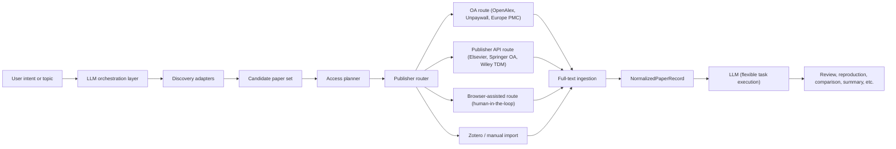

# paper-search-agent Design Plan

## 1. Project Goal

`paper-search-agent` is a new local-first paper agent designed to solve the following problems:

- let an LLM work with more than generic web search and OA links;
- turn discovery, access planning, full-text retrieval, and ingestion into one orchestrated pipeline;
- make campus-network access, institutional subscriptions, and local browser sessions part of the retrieval strategy;
- preserve the ability to use OpenAlex, Crossref, Scopus, Unpaywall, Europe PMC, publisher APIs, browser automation, and Zotero together — with every source individually configurable;
- transform each paper into a normalized, section-structured record that an LLM can reliably consume for any downstream task.

This project must not treat "search" and "full-text access" as the same thing. The system is explicitly split into:

1. discovery
2. full-text access

That split is the primary architectural rule.

### 1.1 Current Repository Status (2026-03-13)

This repository is already beyond the pure scaffold stage. The MCP server under `mcp/paper-search-agent-mcp` builds successfully from source, and the codebase already implements the main tool groups described in this document.

Implemented now:

- MCP server entrypoint, config loader, and tool registry
- discovery adapters for OpenAlex, Crossref, Unpaywall, Springer Meta, Scopus, arXiv, PubMed, and Europe PMC
- access planning with route ordering, OA checks, cache checks, and entitlement notes
- retrieval routes for OA downloads, Europe PMC XML, Elsevier API, Springer OA API, Wiley direct TDM links, browser-assisted retrieval, and manual import
- local cache, corpus management, audit logging, and JSON/CSV/BibTeX export
- parsing for XML, HTML, and plain text, plus section extraction and token-budget advice
- Zotero lookup, save, and collection listing through the Zotero Web API

Still incomplete or only partially aligned with the design:

- `semantic_scholar` exists in the config surface, but no adapter or tool wiring is present yet
- the Elsevier preflight helper exists in code, but the planner does not call it before selecting the route
- PDF parsing inside the MCP server is still a placeholder record, not real text extraction
- the reliable Codex install path today is source build plus `codex mcp add`; package-manager global install should be treated as optional only after a real publish workflow exists

### 1.2 Current Codex Installation Path

For Codex, the reliable install path today is: build the MCP server from source, copy a local `config.toml`, then register the built stdio server with Codex.

Windows / PowerShell flow:

1. `cd mcp\paper-search-agent-mcp`
2. `cmd /c npm install`
3. `cmd /c npm run build`
4. `Copy-Item config.toml.example ..\..\config.toml`
5. `codex mcp add paper-search-agent -- cmd /c node <ABS_PATH_TO_REPO>\mcp\paper-search-agent-mcp\dist\server.js`

Notes:

- Codex CLI stores MCP registrations in `~/.codex/config.toml`
- the versioned example file is `mcp/paper-search-agent-mcp/config.toml.example`; the real `config.toml` should stay local to the machine using the agent
- if you later choose to use `npm link`, you can register the command name directly, but that is optional

## 2. Key Judgments

### 2.1 Scopus Is Not a Unified Full-Text Layer

`Scopus` can discover papers from many publishers, but it is fundamentally an abstract and citation index, not a cross-publisher full-text service. It is useful for:

- search entry points;
- DOI, EID, author, venue, and topic metadata;
- ranking, filtering, and de-duplication.

It should not be modeled as "if Scopus found it, the system can fetch its full text."

### 2.2 Elsevier Full-Text Access Exists, but It Is Entitlement-Constrained

Elsevier's official `Article Retrieval API` can return full-text XML or text when entitlement conditions are satisfied. However, this does not mean "any API key can read any Elsevier paper." In practice:

- the paper must fall within `ScienceDirect` retrievable content;
- the client must be on an entitled campus network whose IP range is recognized by Elsevier;
- a personal `ELSEVIER_API_KEY` (registered at dev.elsevier.com) is required, but alone it is not sufficient for full text;
- without campus-network entitlement, the system may only get abstract-level content or a 403 authorization failure.

Note: Elsevier's `Institutional Token` (`X-ELS-Insttoken`) exists as an alternative entitlement mechanism that works outside campus IP ranges, but it requires the university library administrator to apply through Elsevier's developer portal. This project does not rely on institutional tokens. The primary entitlement path is **personal API key + campus-network IP**.

As a result, the statement in `paper-search-mcp-nodejs` that Elsevier full text is not available is best interpreted as "this project does not currently implement a stable entitlement-aware Elsevier full-text route," not "Elsevier has no official full-text capability."

### 2.3 OpenAlex Is an OA Layer, Not a Subscription Replacement

`OpenAlex` is extremely useful for:

- retrieving `best_oa_location`;
- checking `is_oa` and `oa_status`;
- downloading publicly available PDFs or using its open-content ecosystem;
- filling gaps when publisher APIs are unavailable for OA items.

But it cannot replace institutional entitlement, and it cannot replace subscription full-text routes for ScienceDirect, Springer, or Wiley.

### 2.4 Local Execution Is a Core Requirement, Not an Implementation Detail

For subscription literature access, local execution is a core feature because it can leverage:

- campus-network IP authorization;
- local browser login sessions;
- local institutional proxy or SSO state;
- local download directories and cached PDFs;
- local reference-management tools such as Zotero.

Therefore, the project's critical full-text actions must run locally through local MCP tools, local browser automation, and local storage rather than assuming a remote cloud workflow.

### 2.5 Springer Nature Has No Subscription Full-Text API

Springer Nature provides two public APIs:

- **Meta API v2** (`api.springernature.com/meta/v2`): returns metadata for all Springer content (subscription and OA), but never full text.
- **OpenAccess API** (`api.springernature.com/openaccess`): returns full-text JATS XML, but only for open-access content.

There is no public REST API for retrieving subscription Springer full text. For non-OA Springer papers, the only viable route is browser-based access through SpringerLink on an entitled campus network. The system must treat `springer_fulltext_api` as an OA-only route and must not assume API-based subscription full-text access exists.

### 2.6 Unpaywall Is a Direct OA Location Service

`Unpaywall` (accessed via the Unpaywall API using a DOI and email) provides a focused, per-DOI lookup that returns the best available open-access PDF URL. It is often more accurate and faster than OpenAlex for locating specific OA copies. It should be used alongside OpenAlex as a complementary OA check layer, not as a replacement.

### 2.7 Wiley TDM API Has Specific Constraints

Current repository reality:

- the implemented Wiley adapter does not use a `CR-Clickthrough-Client-Token`
- it resolves TDM-intended links from Crossref metadata and then attempts direct XML or PDF retrieval
- direct access may still require OA availability, institutional IP entitlement, or an already-authenticated Wiley browser session
- when direct download fails, the normal fallback is the browser-assisted route

Wiley's TDM (Text and Data Mining) API is accessed via Crossref's Click-Through Service using a `CR-Clickthrough-Client-Token`. Key constraints:

- it only supports **download by DOI**, not keyword search;
- the token must be obtained by registering at Crossref and accepting Wiley's TDM license;
- access is still subject to institutional subscription — the token alone does not grant universal access;
- if the institution does not subscribe to a given Wiley journal, the download will fail.

The system should use Crossref search to discover Wiley articles, then attempt TDM download by DOI, with browser fallback for cases where TDM access is denied.

## 3. Design Principles

- Local-first: access-sensitive actions must run on the user's machine.
- Adapter-first: each publisher and discovery source must live behind an adapter.
- Entitlement-aware: every full-text request must be preceded by route planning.
- Configurable: every discovery source and retrieval route must have an on/off switch in the project configuration file, allowing users to freely enable or disable individual databases and features.
- Human-in-the-loop: when browser automation encounters verification challenges (CAPTCHA, cookie consent, login prompts), the system must pause and present the challenge to the user rather than failing silently. Successfully completed human interactions should be state-saved to minimize future interruptions.
- Flexible orchestration: the LLM should decide how to combine available tools based on the user's request, rather than being forced through a fixed multi-step pipeline. The system provides capabilities; the LLM chooses the workflow.
- Token-aware: full-text papers can be extremely long. The system must support section-level chunking and selective extraction to manage LLM context and cost.
- Agent-backend agnostic: the project is developed primarily with OpenAI Codex CLI as the agent backend, but the MCP server, skills, and core logic must not depend on Codex-specific features. A setup script provides optional Claude Code compatibility by generating the required `CLAUDE.md` and `.mcp.json` files from the Codex-native sources.
- Compliant by design: subscription content must remain within permitted local storage and usage boundaries.
- Observable: every search, route decision, download attempt, and failure must be recorded.
- Graceful fallback: if one route fails, the system must downgrade to OA, browser-assisted retrieval, or manual import without collapsing the workflow.

## 4. Top-Level Architecture



## 5. System Layers

### 5.1 Discovery Layer

This layer discovers papers. It must not assume that every discovered paper is retrievable as full text.

All discovery sources must have an on/off switch in the configuration file so users can enable only the sources they need or have credentials for.

Suggested integrations:

- `OpenAlex` — primary OA discovery and metadata
- `Crossref` — DOI normalization, metadata, publisher inference
- `Scopus` — high-quality citation-network discovery (requires `ELSEVIER_API_KEY`)
- `Springer Meta API` — Springer Nature metadata discovery
- `arXiv` — preprints in physics, CS, math, etc.
- `PubMed` / `Europe PMC` — biomedical literature; Europe PMC can also provide free full-text XML for many biomedical papers and should be treated as both a discovery and a retrieval source
- `Semantic Scholar` — AI-powered semantic search, citation network
- `Unpaywall` — per-DOI OA location lookup, complements OpenAlex
- local browser-based site search on publisher pages (optional, human-assisted)

Normalized output should be a `CandidatePaper` record:

- title
- doi
- authors
- venue
- year
- abstract
- source
- source_rank
- publisher_hint
- open_access_hint
- landing_page_url

### 5.2 Access Planner

This is the core module of the system. It does not fetch content directly. It decides how content should be fetched.

Inputs:

- `CandidatePaper`
- local environment state
- current machine network context
- configured credentials
- known local cache state

Output: `AccessPlan`

- preferred_route
- fallback_routes
- entitlement_confidence
- required_credentials
- requires_browser_session
- legal_notes
- expected_artifact_type

Typical `preferred_route` values:

- `oa_openalex`
- `oa_unpaywall`
- `oa_publisher`
- `elsevier_api_fulltext`
- `springer_oa_api`
- `europe_pmc_fulltext`
- `wiley_tdm_download`
- `browser_download_pdf`
- `browser_capture_html`
- `zotero_existing`
- `manual_import_pdf`

#### Access Decision Rules

The access planner should evaluate routes in the following order:

1. canonicalize the paper identifier, preferring DOI over publisher-local IDs;
2. infer the publisher and landing host from DOI metadata and resolved URLs;
3. check whether a compliant local cached artifact already exists;
4. check whether a stable OA route exists;
5. evaluate publisher-specific API routes that require entitlement;
6. evaluate browser-assisted retrieval routes;
7. fall back to manual import only when automated routes are exhausted.

Credential and entitlement precedence should follow this order:

1. valid local cache
2. existing Zotero library entry (if Zotero integration is enabled)
3. OA route (OpenAlex, Unpaywall, Europe PMC, publisher OA)
4. publisher API key combined with a locally entitled campus-network context (Elsevier)
5. Wiley TDM token (subject to institutional subscription)
6. valid local browser session with full-text access (human-assisted when verification is needed)
7. manual import

The planner should not use static campus IP lists. Instead, it should infer local entitlement from preflight results generated on the user's machine.

Retry and downgrade rules should be explicit:

- transient network failures should retry on the same route before downgrading;
- authorization or entitlement failures should downgrade immediately to the next route;
- parser failures should first try an alternate parser for the same artifact type, then downgrade to an alternate artifact type;
- all downgrades should be written to `AccessAttempt` records.

#### Preflight Success Conditions

The planner should define route readiness using publisher-specific checks:

- Elsevier route is ready when the DOI resolves to an Elsevier or ScienceDirect record, `ELSEVIER_API_KEY` is configured, and campus-network entitlement is confirmed by a preflight request.
- Springer OA API route is ready when the DOI maps to Springer Nature content and the OpenAccess API confirms the paper is available as open access. For non-OA Springer content, the system must skip the API route entirely and plan a browser route.
- Wiley TDM route is ready when Wiley ownership is confirmed and the adapter can resolve or construct Wiley XML/PDF links. Direct download may still fail because of institutional access or Cloudflare checks, so the browser route remains the expected fallback in the current codebase.
- Europe PMC route is ready when a PubMed ID or DOI maps to a Europe PMC record that includes free full-text XML.
- Browser route is ready when a local browser session can open the landing page. If the page requires human verification (CAPTCHA, login, cookie consent), the system pauses and presents the challenge to the user. Successfully completed verifications should have their browser state (cookies, sessions) saved to minimize future interruptions.
- Zotero route is ready when the Zotero MCP integration is configured and the paper already exists in the user's Zotero library with an attached PDF.
- Manual import route is always available as the last-resort fallback.

### 5.3 Publisher Router

Based on DOI prefix, landing host, and publisher metadata, the router dispatches a paper to a concrete adapter:

- Elsevier adapter (API fulltext via campus IP)
- Springer adapter (OA API only; subscription content via browser)
- Wiley adapter (TDM by DOI; browser fallback)
- Europe PMC adapter (free fulltext XML for biomedical papers)
- generic DOI landing adapter
- OA adapter (OpenAlex + Unpaywall)

Recommended route priority:

1. local cache hit
2. Zotero existing attachment
3. OpenAlex / Unpaywall OA
4. Europe PMC free full text
5. official publisher API (Elsevier campus-entitled, Springer OA, Wiley TDM)
6. publisher browser route (human-assisted)
7. manual import

### 5.4 Full-Text Ingestion

The system should support multiple artifact types:

- XML (JATS, Elsevier XML, Europe PMC XML)
- HTML
- PDF
- plain text
- local attachment

#### PDF Processing Strategy

Current repository reality:

- `parse_paper` handles XML, HTML, and plain text directly inside the MCP server
- for PDF, the current implementation only returns a placeholder `NormalizedPaperRecord` that tells the caller to read the PDF separately
- true PDF text extraction is still a follow-up task, so PDF-heavy workflows currently depend on the agent's native file-reading ability or future local parsers

PDF is the most common full-text format but also the hardest to parse reliably, especially for academic papers with complex layouts (double columns, tables, equations, footnotes).

The near-term PDF processing approach should be agent-native reading for small numbers of PDFs plus a future pluggable local parser. The current repository does not yet perform PDF text extraction inside the MCP server itself.

The system should reserve the ability to integrate local PDF extraction tools in the future (such as `marker`, `nougat`, `docling`, or similar tools) through a pluggable parser interface. This is important for:

- offline or batch processing scenarios where sending PDFs to an LLM is cost-prohibitive;
- extracting structured data (tables, figures) that benefit from specialized tooling;
- Chinese-language and other non-Latin PDFs that may require specialized OCR or layout detection.

#### Multilingual Support

The system should be able to handle non-English academic papers, including Chinese-language content. If any integrated parsing tool does not support Chinese text extraction, an alternative tool or fallback path should be provided.

These should be normalized into a `NormalizedPaperRecord`:

- metadata
- access_record
- content_format
- section_map
- extracted_text
- references
- figures_index
- tables_index

### 5.5 LLM Consumption Layer

The system should prepare `NormalizedPaperRecord` as the primary input for downstream LLM workflows. The system does **not** prescribe specific output formats (such as fixed JSON schemas for summaries, method checklists, or comparison tables). Instead, it provides the LLM with:

- structured, section-segmented full text;
- clean metadata;
- access and provenance records.

The LLM is free to decide how to use this content based on the user's actual request — whether that is writing a literature review, extracting methods for reproduction, comparing approaches, or any other task.

#### Token Budget and Chunking

Full-text academic papers can range from 20k to 80k+ tokens. Long review papers may exceed 100k tokens. The system must support:

- **section-level selective extraction**: allow the LLM to request specific sections (e.g., Methods, Results) rather than the entire paper;
- **chunked delivery**: for very long papers, split content into sequential chunks that fit within context windows;
- **abstract-first triage**: when processing many papers in batch, provide abstracts and metadata first, then retrieve full text only for papers the LLM determines are relevant;
- **cost-conscious routing**: for tasks like initial screening of 30+ papers, consider using a cheaper model or the abstract-only mode before committing to full-text extraction of each paper.

## 6. Proposed Project Layout

Current repository reality:

- the versioned runtime config file is `mcp/paper-search-agent-mcp/config.toml.example`, not a committed `config.toml`
- the actual `config.toml` should stay local to the machine or workspace using the agent
- `plan/` is optional development material rather than a runtime dependency
- the MCP server, skills, and scripts listed below already exist; this section should be read as a snapshot scaffold, not as a future TODO list

Recommended directory tree:

```text
paper-search-agent/
├── README.md
├── AGENTS.md                    # Codex-native root agent instructions (single agent)
├── design-plan.md
├── .env.example
├── .gitignore
├── scripts/
│   ├── setup-claude.sh          # generate CLAUDE.md + .mcp.json for Claude Code compat
│   └── setup-claude.ps1         # Windows PowerShell version
├── plan/
│   ├── task_plan.md
│   └── notes.md
├── skills/                      # Agent Skills standard; shared by Codex and Claude Code
│   ├── README.md
│   ├── topic-scoping/
│   │   └── SKILL.md
│   ├── access-routing/
│   │   └── SKILL.md
│   └── fulltext-ingestion/
│       └── SKILL.md
├── mcp/
│   ├── README.md
│   └── paper-search-agent-mcp/
│       ├── package.json
│       ├── tsconfig.json
│       ├── config.toml              # MCP-local config (authoritative)
│       └── src/
│           ├── server.ts
│           ├── config.ts
│           ├── tools/
│           ├── adapters/
│           │   ├── discovery/
│           │   ├── publishers/
│           │   ├── browser/
│           │   ├── integrations/
│           │   ├── retrieval/
│           │   ├── parsing/
│           │   ├── export/
│           │   └── storage/
│           ├── planners/
│           ├── schemas/
│           └── utils/
├── schemas/
│   └── README.md
├── cache/
├── corpus/
└── artifacts/
```

Files generated by the Claude Code compatibility script (not committed to git):

- `CLAUDE.md` — copied from root `AGENTS.md`
- `.mcp.json` — generated from MCP server definitions in config

At the current stage, only the design scaffold is required. The concrete agent, skill, and MCP implementations should be added in phases.

## 7. Orchestration Architecture: Single Agent + Skills

### 7.1 Rationale: Why Not Multi-Agent?

The original design defined two sub-agents (`query-conductor`, `access-planner`) alongside three skills (`topic-scoping`, `access-routing`, `fulltext-ingestion`). In practice, this creates problems:

1. **Duplicated knowledge.** `query-conductor` and `topic-scoping` contain the same domain knowledge (keyword expansion, source prioritization). `access-planner` and `access-routing` are similarly redundant. Maintaining two documents that say the same thing is a liability.
2. **No parallelism benefit.** The workflow is serial: discovery → access planning → retrieval → parsing. Delegating to sub-agents adds context-passing overhead without enabling parallelism.
3. **Shared tool set.** All agents call the same 14+ MCP tools. Codex multi-agent is most valuable when different agents operate on different tools, files, or codebases — not applicable here.
4. **Context fragmentation.** Sub-agents receive serialized context. The access planner needs full discovery results; splitting into a separate agent means re-transmitting entire candidate lists, wasting tokens.
5. **Codex multi-agent sweet spot.** Codex multi-agent excels at: front-end/back-end separation, cross-language tasks, sandboxed subtasks that can run independently. A single MCP-tool-using research pipeline does not benefit.

### 7.2 Adopted Model: Single Root Agent + Skills

The project uses a **single root agent** (defined in `AGENTS.md`) that reads **skills on demand** for domain-specific knowledge:

```
AGENTS.md (root agent)           ← sole orchestrator
  ├── skills/topic-scoping/      ← read when planning searches
  ├── skills/access-routing/     ← read when planning access routes
  ├── skills/fulltext-ingestion/ ← read when parsing artifacts
  └── MCP tools (14+)           ← called directly by root agent
```

- **No sub-agents.** The `agents/` directory is removed.
- **Skills are reference material**, not execution entities. The root agent reads a skill's SKILL.md when entering the relevant workflow phase.
- **The root agent decides the workflow.** Based on the user's request, it freely combines discovery → planning → retrieval → parsing steps, skipping irrelevant stages.

### 7.3 Flexible Orchestration (Unchanged)

The project does **not** use a fixed multi-step orchestration chain. The LLM decides how to combine available tools and skills based on the user's actual request.

Examples:

- "Find papers on topic X" → read `topic-scoping`, use discovery tools, stop.
- "Get the full text of this DOI" → read `access-routing`, use retrieval tools directly.
- "Write a literature review on topic X" → chain discovery → planning → retrieval → reading → synthesis.
- "Extract the method from this downloaded paper" → use `import_local_file` plus `parse_paper`.

The shared data objects remain explicit:

- `SearchBrief`
- `CandidatePaper`
- `AccessPlan`
- `AccessAttempt`
- `NormalizedPaperRecord`

## 8. Skill Design

For the MVP, three core skills are defined. These contain domain-specific knowledge that helps the LLM make better decisions. Additional skills (evidence synthesis, reproduction mapping, corpus curation, etc.) can be added later as the system matures.

### 8.1 `topic-scoping`

Purpose:

- translate a natural-language request into a structured retrieval brief.

Core content:

- research-question framing
- keyword expansion
- source prioritization
- review depth levels

### 8.2 `access-routing`

Purpose:

- determine whether a paper should use OA, a publisher API, browser retrieval, or manual import.

Core content:

- DOI or host to publisher mapping
- entitlement preflight
- fallback order
- error handling
- configuration switch awareness

### 8.3 `fulltext-ingestion`

Purpose:

- normalize XML, HTML, PDF, and local attachments into a consistent content model.

Core content:

- parser choice (current PDF placeholder plus a reserved interface for future local tools)
- section segmentation
- citation extraction
- content normalization
- multilingual handling (Chinese and other non-Latin content)

## 9. Local MCP Design

### 9.1 Main Objective

The MCP layer should not replace LLM reasoning. It should provide deterministic, local, composable tools.

Recommended implementation:

- follow the multi-service adapter idea from `paper-search-mcp-nodejs`;
- upgrade it into a three-stage system: discovery, entitlement-aware retrieval, and full-text ingestion;
- allow many service integrations, but force them through shared schemas and a shared route planner;
- every adapter must check the configuration switch for its source before executing.

Suggested stack:

- `Node.js + TypeScript` for the MCP server
- `Playwright` for browser-assisted retrieval (with human-in-the-loop for verification challenges)
- agent-native PDF reading or future local parsers for PDF-heavy workflows
- optional Python sidecars or local commands for XML parsing, future local PDF extraction, and multilingual content processing

### 9.2 Configuration Switch System

The runtime must read a local `config.toml` file that controls which sources and features are active. The versioned example file lives at `mcp/paper-search-agent-mcp/config.toml.example`. Every discovery source, publisher adapter, and optional integration should have an explicit on/off switch.

Example structure:

```toml
[runtime]
agent_backend = "codex"  # "codex" (default) or "claude"
# This switch is read by setup scripts and can be used by MCP code
# to adjust backend-specific behavior if needed.

[discovery]
openalex = true
crossref = true
scopus = false           # requires ELSEVIER_API_KEY
springer_meta = true
arxiv = false
pubmed = false
europe_pmc = true
semantic_scholar = false  # reserved in config; adapter not yet implemented in current repo
unpaywall = true

[retrieval]
elsevier_api = true      # requires campus network + ELSEVIER_API_KEY
springer_oa_api = true
wiley_tdm = false        # direct Wiley XML/PDF links; may still require institutional IP or browser session
europe_pmc_fulltext = true
browser_assisted = true
manual_import = true

[integrations]
zotero = false           # requires ZOTERO_API_KEY + ZOTERO_LIBRARY_ID

[browser]
auto_save_state = true   # save cookies/sessions after human verification
state_directory = "./cache/browser-state"

[token_budget]
abstract_first_triage = true    # screen by abstracts before full-text retrieval
max_fulltext_tokens = 60000     # per-paper token limit for chunked delivery
```

The MCP server must read this configuration at startup and only register tools for enabled sources. Disabled sources should not appear as available tools to the LLM.

### 9.3 MCP Tool Groups (Consolidated)

Tools are consolidated to approximately 12 tools to keep the LLM's tool selection manageable.

#### A. Discovery Tools

- `search_papers` — unified multi-source search. Accepts `sources[]` parameter to specify which sources to query (respects config switches). Returns normalized `CandidatePaper[]`.
- `search_single_source` — search a specific source with source-specific parameters. Useful when the LLM needs fine-grained control.

Shared input:

- query
- sources (optional, defaults to all enabled)
- filters (year_range, author, venue, etc.)
- limit

Shared output:

- normalized candidate list with de-duplication

#### B. Resolution and Planning Tools

- `resolve_and_plan` — given a DOI or `CandidatePaper`, resolve the publisher, check OA status (OpenAlex + Unpaywall), check local cache, check Zotero library, and return an `AccessPlan` with preferred route and fallbacks.
- `check_local_cache` — check if a paper is already stored locally.

#### C. Retrieval Tools

- `fetch_fulltext` — unified retrieval tool. Accepts an `AccessPlan` or a DOI and executes the preferred route. Handles OA downloads, Elsevier API calls, Springer OA API, Europe PMC XML, and Wiley TDM automatically based on the plan.
- `browser_retrieve` — open a paper's landing page in a local browser for human-assisted download. The system detects verification challenges (CAPTCHA, login, cookie consent) and pauses for user interaction. After successful access, browser state is saved for future sessions.
- `import_local_file` — import a PDF or other local file that the user provides manually.

#### D. Parsing and Reading Tools

Current repository reality:

- `parse_paper` fully parses XML, HTML, and plain text
- for PDF input, the current implementation returns a placeholder record instead of extracted full text
- the next implementation step is a real PDF extraction path rather than additional description-only planning

- `parse_paper` — extract structured text from a retrieved artifact (XML, HTML, or plain text). For PDF files, the current repository returns a placeholder record and leaves real extraction to future parser work.
- `get_paper_sections` — return specific sections (abstract, methods, results, etc.) from a `NormalizedPaperRecord`, supporting selective section-level extraction to manage token budgets.

#### E. Storage and Corpus Tools

- `manage_corpus` — save, retrieve, list, and de-duplicate papers in a topic corpus.
- `export_records` — export paper records and metadata in various formats.

#### F. Integration Tools

- `zotero_lookup` — search the user's Zotero library through the Zotero Web API for existing papers and PDFs. Only available when Zotero integration is enabled in config.
- `zotero_save` — save a retrieved paper to the user's Zotero library. Only available when Zotero integration is enabled in config.

### 9.4 Zotero Integration

Current repository reality:

- the codebase talks to the Zotero Web API directly
- there is no `zotero-mcp` dependency in the current implementation
- lookup, save, and collection listing are already implemented, but attachment download is still limited by what the Web API exposes

The current repository integrates with Zotero through the Zotero Web API directly. Only a Zotero account, API key, and library ID are needed for the implemented lookup/save flow.

Zotero integration serves two purposes:

1. **Retrieval shortcut**: before attempting any network-based retrieval, check if the paper already exists in the user's Zotero library with an attached PDF.
2. **Output destination**: after retrieving a paper, optionally save it to Zotero with proper metadata for long-term reference management.

Zotero integration is optional and controlled by the `[integrations] zotero` switch in config.

### 9.5 Core MCP Schemas

At minimum, define the following schemas:

- `CandidatePaper`
- `DiscoveryResult`
- `AccessPlan`
- `AccessAttempt`
- `NormalizedPaperRecord`
- `TopicCorpusItem`

`AccessPlan` should include:

- paper_id
- doi
- publisher
- preferred_route
- alternative_routes
- entitlement_state
- required_env
- expected_output
- compliance_constraints
- notes

### 9.6 Local Execution Requirements

Critical retrieval actions must run on the local machine so they can use:

- campus-network IP
- browser login state (with saved cookies/sessions from previous human-verified access)
- local download folders
- personal API keys with campus-network entitlement

This means:

- browser-assisted retrieval must support human interaction when verification is required;
- after human verification, browser state must be saved to minimize future interruptions;
- entitlement preflight must inspect the local environment;
- downloaded artifacts should default to private local storage.

### 9.7 Optional: EZproxy, CARSI, and VPN Support

Some universities provide off-campus access mechanisms:

- **EZproxy**: URL-rewriting proxy that provides campus-like access from off-campus. The system can optionally prefix publisher URLs with the EZproxy base URL.
- **CARSI** (China Academic Resource Sharing Infrastructure): many Chinese universities participate in this Shibboleth-based federation for off-campus scholarly access. Browser-based access through CARSI login can be supported via the human-in-the-loop browser route.
- **Institutional VPN**: when connected to a university VPN, the local machine's outbound IP may be a campus IP, making API-based access work transparently.

These are optional features. The system should detect when campus-network API calls succeed or fail and suggest these alternatives when they are configured.

## 10. Source and Publisher Integration Strategy

### 10.1 OpenAlex

Role:

- primary OA discovery layer
- OA status provider
- metadata source for downstream routing

Strategy:

- always query OpenAlex in the default discovery pass;
- if `is_oa=true`, prefer an OA route first;
- use `best_oa_location` as the first retrieval clue for OA content.

### 10.2 Crossref

Role:

- DOI correction and completion
- metadata normalization
- publisher inference support

Strategy:

- pass discovery results through a Crossref normalization step before final de-duplication.

### 10.3 Scopus

Role:

- high-quality discovery source
- citation-network source
- topic-narrowing layer

Strategy:

- use it to find DOI, author, and topic signals;
- do not model it as a full-text source.

### 10.4 Elsevier / ScienceDirect

Role:

- entitlement-aware official full-text API route

Strategy:

- detect whether a DOI belongs to an Elsevier-retrievable route;
- run `preflight_elsevier` (embedded in `resolve_and_plan`) first;
- if the machine is on an entitled campus network and `ELSEVIER_API_KEY` is configured, call `fetch_fulltext` via the Elsevier adapter;
- if entitlement is absent (403 response), downgrade to OA, browser, or manual routes.

Important design rules:

- never describe Elsevier retrieval as "always available";
- the primary entitlement path is personal API key + campus-network IP;
- treat "abstract available but full text unavailable" as a normal result class.

### 10.5 Springer Nature

Role:

- publisher with OA API and browser dual routes

Strategy:

- use `search_springer_meta` (via Meta API v2) in discovery for metadata;
- use Springer OpenAccess API only for confirmed open-access content — this API returns JATS XML for OA papers only;
- for subscription (non-OA) Springer content, there is no API-based full-text route; the system must use browser-assisted retrieval through SpringerLink on an entitled campus network;
- the route planner must distinguish between Springer OA (API-viable) and Springer subscription (browser-only) papers.

This should be the second subscription adapter implemented after Elsevier.

### 10.6 Wiley

Current repository reality:

- the adapter uses Crossref metadata plus standard Wiley XML/PDF endpoints, not a token-specific Click-Through flow
- the direct route should be treated as best effort, with browser fallback as the expected downgrade path

Role:

- TDM-token-based PDF download, with browser fallback

Strategy:

- Wiley TDM API only supports download by DOI, not keyword search; use Crossref to discover Wiley articles first;
- the TDM token (`CR-Clickthrough-Client-Token`) must be obtained through Crossref's Click-Through Service by registering and accepting Wiley's TDM license;
- TDM access is still subject to institutional subscription — the token alone does not grant universal access;
- if TDM download returns a 403 or fails, fall back to browser-assisted retrieval;
- if browser retrieval also fails (no institutional access), fall back to manual import.

Wiley does not need to be the deepest first-phase adapter, but its interface should be reserved from day one.

### 10.7 Generic Browser Route (Human-in-the-Loop)

Role:

- fallback retrieval path for subscription publishers and edge-case sites

Capabilities:

- resolve DOI landing pages;
- open target pages in a local browser session;
- detect verification challenges (CAPTCHA, cookie consent dialogs, login prompts) and **pause for human interaction** rather than attempting to bypass them;
- after the user completes verification, detect PDF buttons, download links, or HTML full text;
- save browser state (cookies, sessions) after successful human verification to minimize future interruptions;
- send local downloads into the ingestion layer.

This is one of the key differentiators between `paper-search-agent` and a pure API search system. The human-in-the-loop model ensures compliance while still leveraging the user's legitimate campus access.

### 10.8 Unpaywall

Role:

- per-DOI OA location service
- complements OpenAlex as a second OA check layer

Strategy:

- query Unpaywall with DOI + email to find the best available OA PDF URL;
- use as a fast supplementary check alongside OpenAlex's `best_oa_location`;
- the result is a direct PDF URL that can be fetched without any entitlement requirements.

### 10.9 Europe PMC

Role:

- biomedical literature discovery and free full-text XML source

Strategy:

- use Europe PMC as both a discovery source and a retrieval source;
- for papers available in Europe PMC's open full-text corpus, retrieve JATS XML directly via their RESTful API — this does not require campus access or API keys;
- this covers a significant portion of biomedical literature including PubMed Central content.

### 10.10 Zotero

Current repository reality:

- the current implementation uses the Zotero Web API directly
- lookup, save, and collection listing already exist in the MCP server

Role:

- existing library lookup and reference management integration

Strategy:

- integrate via the Zotero Web API directly (no Zotero desktop client required for lookup/save);
- before network retrieval, check if the paper already exists in the user's Zotero library;
- after retrieval, optionally save papers to Zotero for long-term reference management;
- this integration is optional and controlled by the config switch.

### 10.11 Generic Open-Web and Scholar-Style Discovery

Role:

- broad discovery backfill layer
- citation chasing and venue-page lookup layer
- fallback discovery path when formal APIs are incomplete

Strategy:

- provide `search_open_web` as a discovery-only tool;
- allow browser-assisted discovery for scholar-style surfaces when direct API support is unavailable or operationally unsuitable;
- treat these results as leads that must still pass DOI normalization and publisher routing;
- never treat generic web discovery as a substitute for entitlement checks.

## 11. End-to-End Workflows

These workflows illustrate how the system handles different scenarios. The LLM is free to compose these steps flexibly rather than following a rigid pipeline.

### 11.1 OA Happy Path

1. The LLM creates a search plan from the user's topic.
2. `search_papers` queries OpenAlex, Crossref, and other enabled sources.
3. `resolve_and_plan` identifies a candidate with a strong OA signal (via OpenAlex or Unpaywall).
4. `AccessPlan` chooses `oa_openalex` or `oa_unpaywall`.
5. `fetch_fulltext` downloads the OA artifact.
6. `parse_paper` normalizes the artifact into a `NormalizedPaperRecord`.
7. The LLM reads and processes the content according to the user's request.

### 11.2 Elsevier Campus-Network Path

1. Discovery resolves a DOI and infers Elsevier or ScienceDirect ownership.
2. `resolve_and_plan` checks that `ELSEVIER_API_KEY` is configured and tests campus-network entitlement via a preflight request.
3. If preflight passes, `AccessPlan` chooses `elsevier_api_fulltext`.
4. `fetch_fulltext` calls the Elsevier Article Retrieval API.
5. XML or text content is normalized into a `NormalizedPaperRecord`.
6. The LLM extracts evidence, methods, or other content as needed.
7. Subscription content remains in private local storage.

### 11.3 Springer Path (OA vs. Subscription)

1. Discovery identifies Springer Nature content through DOI and metadata.
2. `resolve_and_plan` checks whether the paper is available via the OpenAccess API.
3. If the paper is OA, `fetch_fulltext` retrieves JATS XML via the Springer OA API.
4. If the paper is not OA, `AccessPlan` skips the API route entirely and selects a browser route.
5. `browser_retrieve` opens the SpringerLink page. If verification is needed, the user is prompted to complete it. Browser state is saved.
6. The downloaded artifact is parsed and normalized.

### 11.4 Browser-Assisted Human-in-the-Loop Path

1. Discovery identifies a subscription paper where API routes are unavailable or have failed.
2. `AccessPlan` selects a browser route.
3. `browser_retrieve` opens the paper's landing page in a local browser session.
4. If the page requires human verification (CAPTCHA, cookie consent, institutional login), the system pauses and presents the challenge to the user.
5. The user completes the verification. The system detects successful access and saves browser state (cookies, sessions).
6. The system detects and triggers the PDF download or captures HTML full text.
7. On subsequent retrievals from the same publisher, saved state may allow automatic access without further human intervention.
8. The artifact is recorded together with the retrieval method in `AccessAttempt`.

### 11.5 Manual Import Path

1. Discovery identifies a paper, but automated retrieval is unavailable or intentionally skipped.
2. `AccessPlan` marks `manual_import_pdf` as the final route.
3. The user supplies a local PDF or other local artifact.
4. `import_local_file` and `parse_paper` build a normalized record.
5. The resulting content flows into LLM processing like any other route.

### 11.6 Failure and Downgrade Workflow

1. Every retrieval attempt creates an `AccessAttempt`.
2. Transient failures retry on the same route within a bounded retry budget.
3. Authorization failures immediately trigger the next fallback route.
4. Parser failures try alternate parsers before changing the retrieval route.
5. If all automated routes fail, the planner emits a final manual-import recommendation instead of returning an ambiguous error.

## 12. Relationship to `paper-search-mcp-nodejs`

What should be borrowed:

- multi-service adapter thinking
- Node.js MCP server form factor
- pluggable search-source design

What should be improved:

- add an `AccessPlan` layer instead of searching and immediately trying to fetch;
- include an entitlement-aware Elsevier full-text route (campus IP + personal API key);
- treat local browser retrieval as a first-class capability with human-in-the-loop verification;
- unify OA, subscription API, browser, Zotero, and manual-import routes under one planner;
- consolidate tools from 40+ fine-grained endpoints to ~12 high-level tools that encapsulate internal routing;
- add a configuration switch system so every discovery source and retrieval route can be individually toggled;
- add Unpaywall, Europe PMC, and Zotero as retrieval channels not present in the reference project;
- produce normalized paper records for flexible LLM consumption rather than prescribing specific output formats.

## 13. Compliance and Risk Controls

The system must explicitly enforce the following red lines:

- do not send subscription full text to unauthorized remote storage;
- do not export restricted full text into shared folders by default;
- do not assume campus IP and API entitlement always match;
- do not ignore rate limits or publisher TDM terms;
- do not use browser automation to bypass access controls — the human-in-the-loop model ensures all verification is done by the user.

Recommended controls:

- log every `AccessAttempt`;
- keep subscription artifacts in private local storage by default;
- require user confirmation before any export of restricted content;
- document `allowed artifact types` and `sharing restrictions` for every adapter in config.

## 14. Implementation Phases

This section now contains both historical planning notes and a current-state override. Read the current-state summary below as the authoritative view of the repository.

### 14.0 Current-State Override

Implemented today:

- MCP server bootstrap, config loading, and conditional tool registration
- discovery adapters for OpenAlex, Crossref, Unpaywall, Springer Meta, Scopus, arXiv, PubMed, and Europe PMC
- `search_papers`, `search_single_source`, `resolve_and_plan`, `check_local_cache`, and `manage_corpus`
- retrieval execution for OA downloads, Europe PMC XML, Elsevier API, Springer OA API, Wiley direct links, browser-assisted retrieval, and manual import
- browser HITL flow with saved browser state
- XML, HTML, and plain-text parsing plus section extraction
- local cache, corpus files, audit logging, and export to JSON/CSV/BibTeX
- direct Zotero Web API integration for lookup, save, and collection listing

Still partial or missing:

- planner-side Elsevier preflight is not yet wired before route selection
- PDF handling is placeholder-only inside the MCP server
- Semantic Scholar is still config-only, not implemented
- export restrictions and EZproxy/CARSI support are still future work

Verification snapshot:

- `cmd /c npm run build` succeeds in `mcp/paper-search-agent-mcp`
- live retrieval still depends on real credentials, local browser state, and institutional access on the user's machine

### Phase 0: Design and Scaffold

Deliverables:

- root project structure
- `design-plan.md`
- `AGENTS.md`
- `config.toml` with all source switches (including `[runtime]` section)
- `.env.example`
- `.gitignore` (with Claude-generated files excluded)
- `scripts/setup-claude.sh` and `scripts/setup-claude.ps1`
- schema drafts

### Phase 1: Core Discovery and Access Planner

Implement:

- `search_papers` (OpenAlex + Crossref as initial sources)
- `resolve_and_plan` (DOI resolution, publisher inference, OA check via OpenAlex + Unpaywall)
- `check_local_cache`
- `AccessPlan` schema
- configuration switch system

Goal:

- stabilize the "find papers" and "decide how to retrieve" layers first.

### Phase 2: OA and Local Storage Loop

Implement:

- `fetch_fulltext` (OA routes: OpenAlex, Unpaywall, Europe PMC)
- `import_local_file`
- `parse_paper` (XML and plain text; PDF placeholder today, real extraction later)
- `manage_corpus`

Goal:

- create a reliable OA and manual-import loop before subscription adapters become complex.

### Phase 3: Elsevier Adapter

Implement:

- Elsevier adapter in `fetch_fulltext` (campus-network + API key entitlement)
- XML and text ingestion from Elsevier Article Retrieval API
- entitlement diagnostics (detect 403 vs. other errors)

Goal:

- validate the official Elsevier full-text route under campus-network conditions.

### Phase 4: Browser Route and Springer/Wiley

Implement:

- `browser_retrieve` with human-in-the-loop verification
- browser state saving and restoration
- Springer OA API adapter
- Springer subscription content via browser route
- Wiley TDM adapter (optional, if token is available)

Goal:

- establish browser-assisted retrieval as a general fallback for subscription content.

### Phase 5: Integrations and Hardening

Implement:

- Zotero integration (`zotero_lookup`, `zotero_save`)
- additional discovery sources (Scopus, Semantic Scholar, arXiv, PubMed)
- audit logs
- export restrictions
- EZproxy/CARSI support (optional)

Goal:

- turn the system into a durable, full-featured research tool.

### Phase Acceptance Criteria

- Phase 0 is accepted when the scaffold exists, the filenames are internally consistent, `config.toml` has switches for all planned sources, and the environment template covers the core credentials and storage paths.
- Phase 1 is accepted when the same topic can produce normalized candidates from at least OpenAlex and Crossref, DOI normalization works, and `AccessPlan` returns both a preferred route and fallbacks with human-readable reasoning.
- Phase 2 is accepted when one OA paper and one locally imported paper can both be converted into `NormalizedPaperRecord` and read by the LLM.
- Phase 3 is accepted when an entitled Elsevier paper returns full text on a campus network, while a non-entitled Elsevier paper downgrades cleanly without pretending retrieval succeeded.
- Phase 4 is accepted when browser-assisted retrieval works with human verification, browser state is saved, Springer OA content is retrievable via API, and subscription content is retrievable via browser.
- Phase 5 is accepted when Zotero lookup and save work, at least two additional discovery sources are operational, and audit logs track all retrieval attempts.

## 15. Recommended First MVP

Current repository reality: this MVP has effectively been reached from source build, except that PDF extraction is still manual or external and Semantic Scholar is still unimplemented.

If the goal is to validate value quickly with the smallest practical scope, the recommended MVP is:

1. `OpenAlex + Crossref + Unpaywall` for discovery and OA location
2. `AccessPlan` as the routing core with configuration switches
3. `Elsevier API` as the official subscription full-text route (campus IP + personal API key)
4. `Europe PMC` for free biomedical full text
5. `Browser-assisted retrieval` with human-in-the-loop for Springer and other subscription content
6. agent-native or future local PDF reading support
7. `NormalizedPaperRecord` as the LLM consumption format

Why this is the right first cut:

- it validates the real value of campus-network and local execution;
- it covers both OA and subscription content paths;
- it surfaces the hardest entitlement issues early;
- it forms a complete pipeline without requiring every publisher adapter on day one;
- it does not over-prescribe how the LLM should use the retrieved content.

## 16. Suggested First Implementation Files

Current repository reality: the core files listed below already exist. Keep this section as a map of the first-wave implementation, not as a future creation checklist.

The following files define the first implementation wave and already exist in the current repository:

- `mcp/paper-search-agent-mcp/config.toml.example` — versioned example configuration with source on/off switches and `[runtime]` section
- `scripts/setup-claude.sh` — Claude Code compatibility generator (see §18)
- `scripts/setup-claude.ps1` — Windows PowerShell version
- `mcp/paper-search-agent-mcp/src/config.ts` — configuration reader
- `mcp/paper-search-agent-mcp/src/schemas/access-plan.ts`
- `mcp/paper-search-agent-mcp/src/schemas/candidate-paper.ts`
- `mcp/paper-search-agent-mcp/src/adapters/discovery/openalex.ts`
- `mcp/paper-search-agent-mcp/src/adapters/discovery/crossref.ts`
- `mcp/paper-search-agent-mcp/src/adapters/discovery/unpaywall.ts`
- `mcp/paper-search-agent-mcp/src/planners/access-planner.ts`
- `mcp/paper-search-agent-mcp/src/adapters/publishers/elsevier.ts`
- `mcp/paper-search-agent-mcp/src/adapters/publishers/europe-pmc.ts`
- `mcp/paper-search-agent-mcp/src/adapters/browser/playwright-retriever.ts`
- `skills/topic-scoping/SKILL.md`
- `skills/access-routing/SKILL.md`
- `skills/fulltext-ingestion/SKILL.md`

## 17. Final Recommendation

This project should not become "a bigger paper search script." It should become:

- a local scholarly-access orchestrator;
- a system that explicitly separates discovery from entitlement-aware full-text access;
- a multi-route platform that supports OA, publisher APIs, human-assisted browser retrieval, and manual import;
- a configurable system where every source can be individually enabled or disabled;
- an LLM-facing content preparation layer that turns retrieved content into normalized, section-structured inputs — without prescribing what the LLM should do with them.

If development starts next, the safest order is:

1. build schemas, configuration system, and the planner first;
2. then implement OpenAlex, Crossref, Unpaywall, and the OA loop;
3. then add Elsevier campus-network adapter;
4. then add browser-assisted retrieval with human-in-the-loop;
5. then extend with Zotero integration, additional sources, and hardening.

That order is the most stable path and matches the access constraints identified in the research phase.

## 18. Agent Backend Compatibility

### 18.1 Design Principle

The project is developed and tested primarily with **OpenAI Codex CLI** as the agent backend. All instruction files, directory conventions, and MCP configurations follow Codex conventions by default. In the current repository, Codex usage means "build the local MCP server, create a local config file, then register the stdio command with `codex mcp add`."

At the same time, the project preserves full compatibility with **Anthropic Claude Code** through an optional setup script. The two backends share:

- the same MCP server code, tools, adapters, and schemas;
- the same `config.toml` configuration;
- the same skill definitions (`SKILL.md` follows the Agent Skills open standard, supported by both);
- the same `.env` credentials and local storage.

The only files that differ between backends are the agent instruction files and MCP registration format.

### 18.2 What Differs Between Backends

| Aspect | Codex (default) | Claude Code (optional) |
|---|---|---|
| Agent instruction file | `AGENTS.md` | `CLAUDE.md` |
| MCP server registration | `codex mcp add ...` (stored in `~/.codex/config.toml`) | `.mcp.json` (JSON) |
| Skill directory | `skills/` (shared) | `skills/` (shared) |
| Skill file format | `SKILL.md` (Agent Skills standard) | `SKILL.md` (Agent Skills standard) |
| Config file | `config.toml` (shared) | `config.toml` (shared) |

### 18.3 Compatibility Script

The repository includes `scripts/setup-claude.sh` (and `scripts/setup-claude.ps1` for Windows) that generates Claude Code compatibility files:

1. **Copy instruction files**: copy `AGENTS.md` to `CLAUDE.md` at the project root.
2. **Generate `.mcp.json`**: write a Claude Code MCP entry that points to `node mcp/paper-search-agent-mcp/dist/server.js`.
3. **Verify skills**: confirm that `skills/*/SKILL.md` files are present and compatible (no conversion needed).

All generated files are listed in `.gitignore` so they do not pollute the repository:

```gitignore
# Generated by scripts/setup-claude — do not commit
CLAUDE.md
.mcp.json
```

### 18.4 Usage

For Codex users (default):

Current repository reality:

- cloning the repo is not enough on its own
- you must build `mcp/paper-search-agent-mcp`, create a local `config.toml`, and register the built server with `codex mcp add`

Suggested Windows flow:

```powershell
git clone <repo>
cd <repo>\mcp\paper-search-agent-mcp
cmd /c npm install
cmd /c npm run build
Copy-Item config.toml.example ..\..\config.toml
codex mcp add paper-search-agent -- cmd /c node <ABS_PATH_TO_REPO>\mcp\paper-search-agent-mcp\dist\server.js
```

The short bash snippet below is a legacy note and should not be read as the actual Codex install path.

```bash
git clone <repo>
# Legacy note only. Use the local build + `codex mcp add` flow above.
```

For Claude Code users:

```bash
git clone <repo>
./scripts/setup-claude.sh
# CLAUDE.md and .mcp.json are generated — Claude Code is ready
```

On Windows:

```powershell
git clone <repo>
.\scripts\setup-claude.ps1
```

### 18.5 Runtime Switch

The `[runtime]` section in `config.toml` includes an `agent_backend` field:

```toml
[runtime]
agent_backend = "codex"  # "codex" or "claude"
```

This field is primarily informational and used by the setup script. The MCP server code itself is backend-agnostic — it does not change behavior based on which agent backend calls it. However, if future backend-specific adjustments are needed (e.g., different tool description styles or response formatting), this switch provides the hook point.

### 18.6 Maintenance Rule

All instruction content is authored in `AGENTS.md` files only. `CLAUDE.md` files are never edited directly — they are always regenerated from the corresponding `AGENTS.md` by the setup script. This single-source-of-truth approach prevents drift between the two backends.
